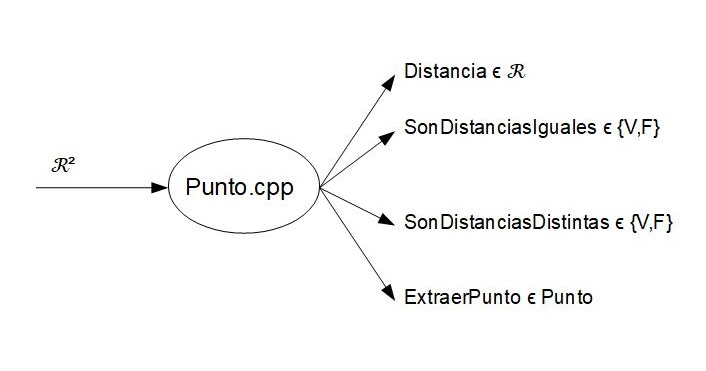

# Punto

## Valores
### Punto = {p=(a,b)/(a,b) ϵ ℛ²}

## Operaciones
### *Distancia
#### -Entrada: a,b ϵ Punto
#### -Salida: Dist ϵ ℛ / dist = √(ax+bx)2 + (ay+by)2
 
### *SonDistanciasIguales
#### -Entrada: a,b,c,d ϵ Punto
#### -Salida: Dist ϵ ℛ / SonDistanciasIguales = si (Dist(a,b)=Dist(c,d)) entonces Verdadero

### *SonDistanciasDistintas
#### -Entrada: a,b,c,d ϵ Punto
#### -Salida: Dist ϵ ℛ / SonDistanciasIguales = si (Dist(a,b)=Dist(c,d)) entonces Falso

### *ExtraerPunto
#### -Entrada: a,b ϵ ℛ
#### -Salida: Punto ={(a,b) / (a,b) ϵ ℛ²}

## DIAGRAMA IPO
  

